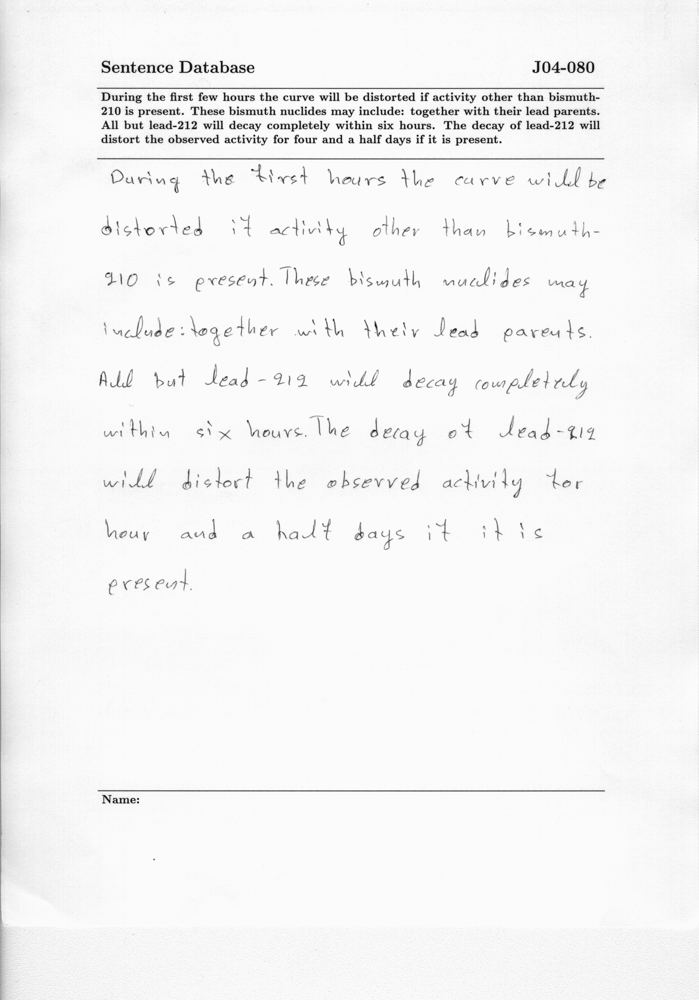

# Proyecto OCR – Extracción Automática de Texto desde Imágenes

# Descripción general del proyecto

Este proyecto implementa un sistema de Reconocimiento Óptico de Caracteres (OCR) capaz de extraer texto desde imágenes digitales utilizando técnicas de preprocesamiento y modelos de visión por computadora.

# Estructura del Repositorio

```text
OCR/
│
├── .venv/               # Entorno virtual del proyecto (no se versiona)
├── examples/            # Ejemplos adicionales o pruebas del sistema
├── images/              # Imágenes de entrada para el OCR
├── results/             # Archivos generados con los resultados del OCR
│
├── src/
│   ├── inferencia.py    # Script principal para ejecutar el sistema
│   ├── ocr_pipeline.py  # Implementación del pipeline OCR
│   └── utils.py         # Funciones auxiliares y preprocesamiento
│
├── .gitignore           # Archivos y carpetas excluidos del control de versiones
├── README.md            # Documentación del proyecto
└── requirements.txt     # Lista de dependencias del proyecto
```


# Requerimientos 

```bash
pip install easyocr=1.7.2
```

El archivo `requeriments.txt` incluye las liberias y versiones para usar esta versión de OCR.

 Si hace una instalación en limpio, la instalación descarga estas versiones automáticamente. De requerir instalar en un ambiente con librerias previas, revisar las versiones documentadas.

# Contenido de la Herramienta

1. Aplicación de un modelo OCR para reconocimiento de texto.

2. Generación de archivo de salida con el texto detectado.

# Construcción de la Herramienta

Las imágenes utilizadas para pruebas fueron obtenidas de la plataforma Kaggle, reconocida internacionalmente por alojar datasets para proyectos de ciencia de datos y aprendizaje automático.

El modelo está diseñado para funcionar con texto digital impreso o generado por computadora, no para reconocimiento de escritura manuscrita.

# Paso a paso para instalación

1. Clonar el repositorio
git clone https://github.com/anthonydcroz15/OCR

2. Crear entorno virtual
python -m venv .venv

3. Activar entorno virtual

En Windows:

```bash
.venv\Scripts\activate
```

En macOS / Linux:

```bash
source .venv/bin/activate
```

4. Instalar dependencias
```bash
pip install easyocr=1.7.2
```
> Nota: Revisar sección de requerimentos.


# Instrucciones de uso del script de inferencia

## Ejemplo Básico

1. Identificar archivo que se quiere leer. **Tip:** Puede crear una carpeta de imagenes o inputs dentro de la carpeta `OCR/`. De lo contrario, solo debe garantizar que se tengan los permisos al path que se vaya a especificar.

2. Especificar argumentos para usar script de inferencia. Ejemplo de lectura desde path relativo

```
python src/inferencia.py .\examples\inputs\a01-003.png
```

3. Revisar resultados. En este ejemplo, al no especificar la ruta, los archivos se encontraran en el directorio desde el que se ejecutó la inferencia.

* Resultado A: Contiene el texto extraído.

 `inference_results_20260228_224312.txt`

* Resultado B: Contiene cada palabra con su probabilidad.

 `inference_results_20260228_224312.json`

## Argumentos Inferencia

* `--image_path` : Ruta de la imágen que se va procesar. Opcional solo si se especifica `--image_name`.

* `--image_name` : Nombre del archivo a procesar. Asume que se encuentra en el directorio desde donde se va a ejecutar la inferencia. Opcional solo si se especifica `--image_path`.

* `--out` : Directorio de salida para resultados. Si no se especifica, guarda resultados en directorio actual.

* `--lang` : Idioma de OCR. Por defecto define  `en`. Revisar idiomas disponible en easyOCR[https://github.com/JaidedAI/EasyOCR]

# Ejemplos

## Ejemplo de entrada

Esta es una muestra de los datos de ejemplos que tiene la herramienta para pruebas.



Contenido visual aproximado de la imagen:

"Sentence a Database

During the first few hours the curve will be distorted if activity other than bismuth-210 is present. These bismuth niclides may include: together with their lead parents. All but lead-212 will decay completely within six hours. The decay of lead-212 will distort the pbserved activity for four and a half days if it is present."

## Ejemplo sentencia ejecución

Este ejemplo se hace usando la consolda desde el directorio `OCR/`

```
python src/inferencia.py .\examples\inputs\a01-003.png --out .\examples\outputs  
```
Se definen claramente las rutas de entrada y salida para la ejecución de la tarea.


## Ejemplo de salida (results/output.txt)
```text
Texto reconocido: Sentence Database J04-080 During the first few hours the curve will be distorted if activity other than bismuth- 210 is present. These bismuth nuclides may include: together with their lead parents_ All but lead-212 will decay completely within six hours. The decay of lead-212 will distort the observed activity for four and a half if it is present.
```

# Descripción de archivos principales

1. .venv/: entorno virtual local donde se instalan las dependencias del proyecto. No debe subirse al repositorio.

2. examples/: carpeta destinada a pruebas o ejemplos adicionales del sistema.

3. images/: contiene las imágenes utilizadas como entrada para el proceso OCR.

4. results/: almacena los archivos de salida generados por el sistema (por ejemplo, output.txt).

5. src/: contiene el código fuente del proyecto.

6. utils.py: funciones de preprocesamiento de imágenes.

7. ocr_pipeline.py: implementación del flujo principal del OCR.

8. inferencia.py: punto de entrada para ejecutar el sistema completo.

9. requirements.txt: archivo que permite instalar todas las dependencias del proyecto mediante pip install -r requirements.txt.

# Limitaciones y posibles mejoras

## Limitaciones actuales

1. El modelo funciona correctamente con texto digital impreso.

2. No está optimizado para reconocimiento de texto manuscrito (a mano alzada).

3. El rendimiento depende de la calidad y resolución de la imagen.

4. No se implementan métricas automáticas de evaluación de precisión.

5. Puede disminuir la exactitud en imágenes con ruido, baja iluminación o distorsión.

## Posibles mejoras

1. Implementar modelos especializados en reconocimiento de escritura manuscrita.

2. Incorporar métricas como CER (Character Error Rate).

3. Integrar corrección ortográfica automática.

4. Implementar procesamiento por lotes.

5. Incorporar aceleración por GPU.

6. Desarrollar una interfaz gráfica o versión web.